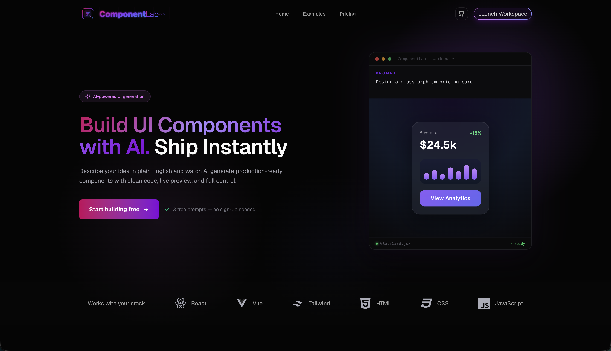
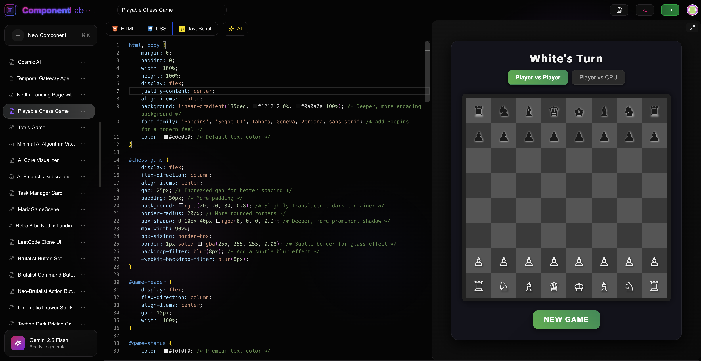
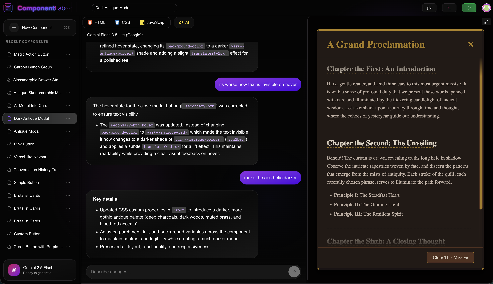

<div align="center">

# ComponentLab

### The AI-first workspace for designing, generating, and iterating on frontend components.

Generate production-ready UI from natural language, refine it through conversational AI, edit it manually with an integrated code editor, and preview every change in real time.

</div>

<p align="center">
  
</p>

---

> 🚧 **Currently in active development.**

---

# ✨ Features

- 🤖 Generate production-ready frontend components from natural language
- 🧠 Multi-turn conversational AI editing with context-aware rework
- 🔀 Support multiple AI models from Google and OpenAI
- ⚡ Stream AI-generated responses directly into the editor
- 🎨 Generate HTML, CSS, JavaScript, and React components
- 🧩 Multiple component styles and design presets
- 📝 Built-in Monaco editor with IDE-level syntax highlighting and code completion
- 🖥️ Live preview with sandboxed component execution
- 📟 Integrated developer console with runtime and component diagnostics
- 🐛 React compile-time, runtime, render, dependency, and Promise error reporting
- 🧪 Structured console output with expandable objects, arrays, Maps, Sets, Errors, and other values
- 📚 Persistent component library
- 💾 Save, organize, and revisit components
- 🗂️ Persistent AI conversation history
- 💬 Streaming chat with Markdown support
- ⌨️ Keyboard shortcuts for common actions

---

## 💻 AI Workspace

Generate frontend components with AI, inspect and edit the generated code, and see every change reflected instantly in the live preview.

<p align="center">
  
</p>

---

## 💬 Conversational Editing

Refine existing components using natural language. ComponentLab maintains conversational context, allowing you to iteratively improve your UI without starting over.

<p align="center">
  
</p>

---

# 🛠 Tech Stack

| Category      | Technology               |
| ------------- | ------------------------ |
| **Framework** | Next.js + React          |
| **Styling**   | Tailwind CSS             |
| **Editor**    | Monaco Editor            |
| **Database**  | PostgreSQL + Prisma      |
| **AI**        | Google Gemini + Open AI  |
| **Streaming** | Server-Sent Events (SSE) |

---

# 🚀 Roadmap

Recent milestones

- [x] Web component generation + preview pipeline
- [x] React component generation + preview pipeline
- [x] Multi-model AI generation and editing
- [x] React preview diagnostics and integrated developer console

- [ ] Web Bundle diagnostics
- [ ] AI interaction modes — Ask, Rework, and Auto
- [ ] Version history & rollback
- [ ] Framework export
- [ ] AI-powered design improvements
- [ ] Vue component generation
- [ ] Component collections
- [ ] Mobile-optimized workspace
- [ ] Custom themes
- [ ] Team collaboration

---

## 🚀 Getting Started

### 1. Create `.env` file in root

```env
DATABASE_URL='postgres://'

AUTH_GITHUB_ID=''
AUTH_GITHUB_SECRET=''

AUTH_SECRET=""

GEMINI_API_KEY=""

OPENAI_API_KEY=""

AUTH_TRUST_HOST=true
```

### 2. Install dependencies

```bash
npm install
```

### 3. Start the development server

```bash
npm run dev
```

Open http://localhost:3000 in your browser by default.

---

<div align="center">

Made with ❤️ for frontend developers.

</div>
